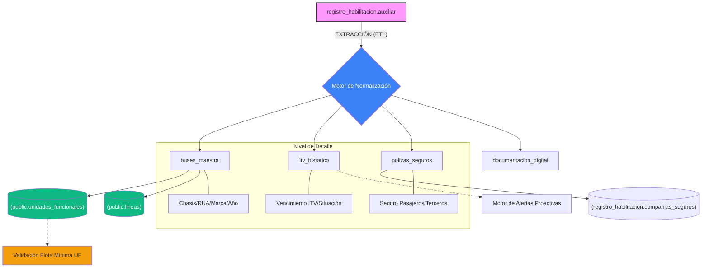

# **PROPUESTA TÉCNICA**

## **SISTEMA DE GESTIÓN DE PARQUE AUTOMOTOR**

### **VICE MINISTERIO DE TRANSPORTE \- PARAGUAY**

---

## **1\. INFORMACIÓN GENERAL**

**Empresa Consultora:** \[Nombre de la Empresa\]  
 **Fecha de Propuesta:** 12 de Junio de 2025  
 **Vigencia de la Propuesta:** 60 días calendario  
 **Tiempo de Ejecución:** 16 semanas (4 meses)  
 **Modalidad:** Desarrollo a medida con metodología ágil

---

## **2\. ANÁLISIS DE LA SITUACIÓN ACTUAL**

### **2.1 Problemática Identificada**

El Vice Ministerio de Transporte actualmente cuenta con una etapa de transición donde los datos del parque automotor residen en una tabla semi-estructurada (**registro_habilitacion.auxiliar**), lo que presenta las siguientes limitaciones para la fiscalización moderna:

* **Falta de Integración Relacional**: Los datos de buses no están vinculados nativamente con las Unidades Funcionales (UF) de la Ley 7617.
* **Procesamiento Manual de Alertas**: Aunque los datos existen, no hay un motor que dispare notificaciones de vencimiento de ITV o Seguros de forma proactiva.
* **Discrepancia Operativa**: El sistema de monitoreo (Simulador) no puede validar si un bus que emite señal tiene sus documentos al día en tiempo real.
* **Dificultad de Auditoría**: La estructura actual de la tabla auxiliar complica el seguimiento histórico de cambios de empresa o renovaciones de flota.

### **2.2 Necesidades Identificadas**

* Sistema integral de gestión con base de datos robusta  
* Alertas automáticas para vencimientos (ITV, seguros, documentos)  
* Reportes dinámicos y personalizables  
* Control de acceso multiusuario  
* Integración preparada para sistemas de monitoreo operativo  
* Gestión histórica de asignaciones empresa-bus  
* Sistema de auditoría y trazabilidad completa

---

## **3\. SOLUCIÓN PROPUESTA**

### **3.1 Descripción General**

Desarrollo de un **Sistema Web Integral de Gestión de Parque Automotor** que centralizará toda la información relacionada con los buses del transporte público, proporcionando herramientas avanzadas para:

* Registro y control completo del parque automotor  
* Gestión de empresas operadoras y líneas de transporte  
* Sistema de alertas inteligente y proactivo  
* Generación de reportes ejecutivos y operativos  
* Control de documentación y seguros  
* Monitoreo de inspecciones técnicas vehiculares (ITV)  
* Auditoría completa de operaciones

### **3.2 Objetivos del Proyecto**

#### **Objetivos Generales**

* Modernizar la gestión del parque automotor mediante tecnología web  
* Mejorar la eficiencia operativa del Departamento de Registro y Habilitación  
* Establecer base tecnológica para integración con sistemas de monitoreo

#### **Objetivos Específicos**

* Implementar base de datos relacional PostgreSQL para gestión robusta de información  
* Desarrollar sistema de alertas automáticas para vencimientos críticos  
* Crear dashboard ejecutivo con KPIs en tiempo real  
* Establecer sistema de reportes dinámicos y personalizables  
* Implementar control de acceso multiusuario con diferentes roles  
* Migrar datos existentes desde Excel manteniendo integridad  
* Capacitar al personal en el uso del nuevo sistema

---

## **4\. ARQUITECTURA TÉCNICA**

### **4.1 Stack Tecnológico**

#### **Backend (Alineado con Simulador CID)**

* **Lenguaje:** Python 3.11+
* **Framework:** FastAPI
* **Base de Datos:** PostgreSQL 15+ (Esquema `registro_habilitacion`)
* **ORM:** SQLAlchemy 2.0 (Integrado con modelos de `public` y `geometria`)
* **Tareas Programadas:** Celery + Redis (para el motor de alertas)

#### **Frontend (Alineado con Simulador CID)**

* **Framework:** React 18 (Vite)
* **UI Styling:** Tailwind CSS + Headless UI (Premium Design)
* **Visualización:** Mapbox GL JS / Leaflet (para ubicación de terminales e ITV)
* **Estado Global:** Context API + React Query

#### **Infraestructura**

* **Servidor Web:** Nginx  
* **Contenedores:** Docker \+ Docker Compose  
* **Base de Datos:** PostgreSQL con replicación  
* **Backup:** Automatizado diario/semanal  
* **Monitoreo:** PM2 \+ logs estructurados  
* **SSL:** Certificado SSL/TLS

### **4.2 Arquitectura del Sistema**

┌─────────────────┐    ┌─────────────────┐    ┌─────────────────┐  
│   FRONTEND     		    │    BACKEND      │    │   BASE DATOS    │  
│   React \+ TS    │◄──►│   Node.js \+ TS  │◄──►│   PostgreSQL    │  
│   Material-UI   │    │   Express.js    │    │   Prisma ORM    │  
└─────────────────┘    └─────────────────┘    └─────────────────┘  
         │                       │                       │  
         ▼                       ▼                       ▼  
┌─────────────────┐    ┌─────────────────┐    ┌─────────────────┐  
│   SEGURIDAD     │    │   SERVICIOS     │    │   MONITOREO     │  
│   JWT \+ RBAC    │    │   Alertas       │    │   Logs \+ Audit  │  
│   Validaciones  │    │   Reportes      │    │   Backup Auto   │  
└─────────────────┘    └─────────────────┘    └─────────────────┘

---

## **5\. FUNCIONALIDADES DETALLADAS**

### **5.1 Módulo de Gestión de Buses**

#### **Funcionalidades Principales**

* **CRUD Completo:** Crear, leer, actualizar, eliminar registros de buses  
* **Importación Masiva:** Carga desde Excel con validaciones  
* **Exportación:** Múltiples formatos (Excel, PDF, CSV)  
* **Búsqueda Avanzada:** Filtros por múltiples criterios  
* **Historial de Cambios:** Auditoría completa de modificaciones  
* **Gestión de Documentos:** Carga y versionado de archivos

#### **Campos Gestionados**

* Información básica: N° Orden, Marca, Año, Chassis, RUA  
* Documentación: POD, RTD, Habilitación, Seguros  
* Inspecciones: ITV anterior, actual, vencimiento, estado  
* Operación: Empresa, línea, tipo de servicio  
* Carrocería: Tipo, marca, especificaciones

### **5.2 Sistema de Alertas Inteligente**

#### **Tipos de Alertas**

* **ITV Vencimientos:** 60, 30, 15, 7, 1 días antes  
* **Seguros:** Pasajeros y terceros próximos a vencer  
* **Documentos:** POD, RTD, habilitaciones vencidas  
* **Inspecciones:** Buses sin ITV vigente  
* **Operativas:** Buses inactivos, cambios de empresa

#### **Características**

* **Priorización Automática:** Alta, Media, Baja según urgencia  
* **Notificaciones Multi-canal:** Email, dashboard, reportes  
* **Escalamiento:** Alertas a supervisores si no se atienden  
* **Configuración:** Días de anticipación personalizables  
* **Seguimiento:** Estado de atención y resolución

### **5.3 Dashboard Ejecutivo**

#### **KPIs Principales**

* Total de buses registrados  
* Buses activos vs. inactivos  
* Estado de ITV (vigente, por vencer, vencido)  
* Estado de seguros por tipo  
* Distribución por empresa operadora  
* Alertas pendientes por prioridad

#### **Visualizaciones**

* Gráficos de barras y torta interactivos  
* Mapas de calor de vencimientos  
* Tendencias históricas  
* Comparativos por período  
* Indicadores de performance

### **5.4 Sistema de Reportes**

#### **Reportes Predefinidos**

1. **Estado General del Parque**

   * Listado completo con estados actuales  
   * Filtros por empresa, línea, tipo de servicio  
   * Exportación múltiple formato  
2. **Vencimientos Próximos**

   * ITV, seguros, documentos por vencer  
   * Agrupación por días restantes  
   * Alertas de acción requerida  
3. **Reporte por Empresa**

   * Parque asignado por operadora  
   * Estado de cumplimiento documental  
   * Histórico de asignaciones  
4. **Estadísticas Operativas**

   * Distribución por tipo de servicio  
   * Análisis de antigüedad del parque  
   * Indicadores de renovación  
5. **Auditoría de Cambios**

   * Historial de modificaciones  
   * Usuarios y fechas de cambios  
   * Trazabilidad completa

#### **Reportes Personalizables**

* Constructor de consultas visual  
* Filtros dinámicos múltiples  
* Campos seleccionables  
* Formato de salida configurable  
* Programación automática

### **5.5 Gestión de Empresas y Líneas**

#### **Funcionalidades**

* **Registro de Empresas:** Datos completos, representantes legales  
* **Gestión de Líneas:** Rutas, tipo de servicio, capacidad  
* **Asignaciones:** Histórico bus-empresa con fechas  
* **Control de Capacidad:** Límites por línea y tipo  
* **Estados:** Activo, inactivo, suspendido

---

## **6\. DISEÑO DE BASE DE DATOS**

### **6.1 Entidades Principales**

#### **Buses**

* Información técnica completa  
* Estados y clasificaciones  
* Relaciones con empresas y líneas  
* Auditoría de cambios

#### **Empresas**

* Datos corporativos  
* Representantes legales  
* Estados operativos  
* Líneas asignadas

#### **Documentos**

* Tipos: POD, RTD, Habilitación, Seguros  
* Fechas de emisión y vencimiento  
* Estados: Vigente, Vencido, Por Vencer  
* Archivos adjuntos

#### **Normalización de la Tabla Auxiliar**
* Migración de `registro_habilitacion.auxiliar` hacia entidades fuertemente tipadas:
    * `buses_maestra`: Unificación con `public.buses`.
    * `itv_historico`: Registro de inspecciones vinculadas a chasis.
    * `seguros_vinculados`: Relación con la tabla existente `registro_habilitacion.companias_seguros`.

#### **Integración con Unidades Funcionales (Ley 7617)**
* Vínculo directo entre el Bus y su **UF** asignada.
* Validación automática de la "Flota Mínima Habilitada" por cada UF en el Simulador.

#### **Alertas**

* Tipos y prioridades  
* Estados de atención  
* Usuarios responsables  
* Fechas de resolución

### **6.2 Características de la Base**

* **Normalización:** Estructura optimizada 3NF  
* **Índices:** Búsquedas optimizadas  
* **Triggers:** Automatización de alertas  
* **Constraints:** Integridad referencial  
* **Particionamiento:** Manejo eficiente de grandes volúmenes  
* **Backup:** Estrategia automática de respaldo

---

## **7\. SEGURIDAD Y CONTROL DE ACCESO**

### **7.1 Autenticación y Autorización**

#### **Sistema de Usuarios**

* **Roles Definidos:**  
  * Administrador: Acceso total  
  * Operador: Gestión de buses y documentos  
  * Consulta: Solo lectura y reportes  
  * Supervisor: Gestión de alertas y reportes avanzados

#### **Seguridad de Acceso**

* **Autenticación:** JWT con refresh tokens  
* **Contraseñas:** Hash bcrypt \+ salt  
* **Sesiones:** Timeout automático  
* **Bloqueo:** Intentos fallidos excesivos  
* **Auditoría:** Log de todos los accesos

### **7.2 Seguridad de Datos**

#### **Protección de Información**

* **Encriptación:** Datos sensibles en reposo  
* **Comunicación:** HTTPS obligatorio  
* **Validación:** Sanitización de inputs  
* **SQL Injection:** Prevención mediante ORM  
* **XSS:** Protección en frontend

#### **Backup y Recuperación**

* **Backup Automático:** Diario y semanal  
* **Versionado:** Múltiples puntos de restauración  
* **Pruebas:** Verificación periódica de backups  
* **Recuperación:** Procedimientos documentados

---

## **8\. MIGRACIÓN DE DATOS**

### **8.1 Estrategia de Migración**

#### **Análisis Previo**

* **Auditoría:** Revisión completa del Excel actual  
* **Mapeo:** Correspondencia de campos  
* **Validación:** Identificación de datos inconsistentes  
* **Limpieza:** Normalización de información

#### **Proceso de Migración**

1. **Extracción:** Datos desde Excel  
2. **Transformación:** Limpieza y validación  
3. **Carga:** Importación controlada  
4. **Verificación:** Validación de integridad  
5. **Rollback:** Plan de contingencia

#### **Herramientas de Migración**

* **Script Personalizado:** Automatización del proceso  
* **Validaciones:** Reglas de negocio aplicadas  
* **Logs:** Registro detallado del proceso  
* **Reporte:** Resumen de migración

### **8.2 Diagrama de Transición de Datos**

A continuación se presenta el flujo lógico de normalización desde la tabla auxiliar actual hacia el nuevo modelo integrado:

---

## **9\. PLAN DE TRABAJO**

### **9.1 Metodología**

**Metodología Ágil \- Scrum**

* Sprints de 2 semanas  
* Reuniones diarias de seguimiento  
* Demos funcionales cada sprint  
* Retroalimentación continua del cliente

### **9.2 Cronograma Detallado**

#### **FASE 1: ANÁLISIS Y DISEÑO (Semanas 1-2)**

**Actividades:**

* Análisis detallado de requerimientos  
* Diseño de base de datos  
* Arquitectura del sistema  
* Prototipado de interfaces  
* Plan de migración de datos

**Entregables:**

* Documento de análisis funcional  
* Diagrama de base de datos  
* Mockups de interfaz  
* Plan de migración  
* Cronograma detallado

#### **FASE 2: DESARROLLO BACKEND (Semanas 3-6)**

**Actividades:**

* Configuración del entorno de desarrollo  
* Implementación de base de datos  
* Desarrollo de APIs REST  
* Sistema de autenticación  
* Módulo de gestión de buses  
* Sistema de alertas básico

**Entregables:**

* Base de datos funcional  
* APIs documentadas  
* Sistema de autenticación  
* Módulo de buses operativo  
* Pruebas unitarias

#### **FASE 3: DESARROLLO FRONTEND (Semanas 7-10)**

**Actividades:**

* Configuración de React \+ TypeScript  
* Implementación de interfaces  
* Dashboard ejecutivo  
* Módulo de gestión de buses  
* Sistema de alertas  
* Reportes básicos

**Entregables:**

* Aplicación web funcional  
* Dashboard operativo  
* Módulos principales  
* Pruebas de interfaz  
* Documentación de usuario

#### **FASE 4: FUNCIONALIDADES AVANZADAS (Semanas 11-13)**

**Actividades:**

* Sistema de reportes avanzado  
* Gestión de empresas y líneas  
* Módulo de documentos  
* Optimización de rendimiento  
* Integración completa

**Entregables:**

* Sistema completo funcional  
* Reportes avanzados  
* Módulos secundarios  
* Optimizaciones aplicadas  
* Pruebas de integración

#### **FASE 5: MIGRACIÓN Y DESPLIEGUE (Semanas 14-15)**

**Actividades:**

* Migración de datos desde Excel  
* Configuración de servidor producción  
* Despliegue de aplicación  
* Pruebas de aceptación  
* Ajustes finales

**Entregables:**

* Datos migrados exitosamente  
* Sistema en producción  
* Pruebas de aceptación  
* Documentación técnica  
* Manual de usuario

#### **FASE 6: CAPACITACIÓN Y CIERRE (Semana 16\)**

**Actividades:**

* Capacitación de usuarios finales  
* Entrega de documentación  
* Transferencia de conocimiento  
* Cierre de proyecto  
* Garantía y soporte

**Entregables:**

* Personal capacitado  
* Documentación completa  
* Sistema en operación  
* Acta de entrega  
* Plan de soporte

---

## **10\. RECURSOS NECESARIOS**

### **10.1 Equipo de Desarrollo**

#### **Recursos Humanos**

* **1 Líder de Proyecto** (16 semanas \- 100%)  
* **1 Arquitecto de Software** (4 semanas \- 100%)  
* **2 Desarrolladores Backend** (10 semanas \- 100%)  
* **2 Desarrolladores Frontend** (8 semanas \- 100%)  
* **1 Especialista en Base de Datos** (6 semanas \- 50%)  
* **1 Tester/QA** (8 semanas \- 50%)  
* **1 DevOps Engineer** (4 semanas \- 50%)  
* **1 Diseñador UX/UI** (4 semanas \- 50%)

#### **Perfiles Requeridos**

* **Líder de Proyecto:** PMP o equivalente, experiencia en proyectos gubernamentales  
* **Desarrolladores:** 3+ años experiencia en stack propuesto  
* **Arquitecto:** 5+ años experiencia en sistemas empresariales  
* **Especialista BD:** Certificación PostgreSQL preferible  
* **Tester:** Experiencia en testing automatizado  
* **DevOps:** Experiencia en Docker y deployment  
* **UX/UI:** Portfolio en aplicaciones web

### **10.2 Recursos Técnicos**

#### **Infraestructura de Desarrollo**

* Servidores de desarrollo y testing  
* Licencias de software necesarias  
* Herramientas de desarrollo  
* Repositorio de código (Git)  
* Herramientas de gestión de proyecto

#### **Infraestructura de Producción**

* Servidor de aplicación  
* Servidor de base de datos  
* Certificados SSL  
* Servicio de backup  
* Monitoreo de aplicación

---

## **11\. PRESUPUESTO**

### **11.1 Inversión Total del Proyecto**

| Categoría | Descripción | Costo (USD) |
| ----- | ----- | ----- |
| **Recursos Humanos** | Equipo de desarrollo completo | $48,000 |
| **Infraestructura** | Servidores, licencias, herramientas | $8,000 |
| **Migración de Datos** | Proceso especializado | $3,000 |
| **Capacitación** | Entrenamiento de usuarios | $2,000 |
| **Documentación** | Manuales técnicos y de usuario | $1,500 |
| **Contingencias** | 10% del total | $6,250 |
| **TOTAL** | **Inversión completa** | **$68,750** |

### **11.2 Desglose por Fases**

| Fase | Duración | Costo | % del Total |
| ----- | ----- | ----- | ----- |
| Análisis y Diseño | 2 semanas | $8,600 | 12.5% |
| Desarrollo Backend | 4 semanas | $17,200 | 25% |
| Desarrollo Frontend | 4 semanas | $17,200 | 25% |
| Funcionalidades Avanzadas | 3 semanas | $12,900 | 18.8% |
| Migración y Despliegue | 2 semanas | $8,600 | 12.5% |
| Capacitación y Cierre | 1 semana | $4,250 | 6.2% |

### **11.3 Modalidad de Pago**

**Esquema de Pagos Propuesto:**

* **20%** al inicio del proyecto ($13,750)  
* **25%** al completar Fase 2 ($17,188)  
* **25%** al completar Fase 3 ($17,188)  
* **20%** al completar Fase 4 ($13,750)  
* **10%** al completar el proyecto ($6,874)

---

## **12\. BENEFICIOS ESPERADOS**

### **12.1 Beneficios Operativos**

#### **Eficiencia Administrativa**

* **Reducción del 70%** en tiempo de consultas  
* **Eliminación** de errores por duplicidad de datos  
* **Automatización** de procesos manuales  
* **Acceso simultáneo** de múltiples usuarios  
* **Centralización** de información

#### **Control y Monitoreo**

* **Alertas proactivas** evitan vencimientos  
* **Trazabilidad completa** de cambios  
* **Reportes en tiempo real** para toma de decisiones  
* **Cumplimiento normativo** automatizado  
* **Auditoría digital** permanente

### **12.2 Beneficios Estratégicos**

#### **Modernización Institucional**

* **Digitalización** de procesos críticos  
* **Base tecnológica** para futuras integraciones  
* **Imagen institucional** mejorada  
* **Preparación** para sistemas integrales  
* **Escalabilidad** para crecimiento

#### **Toma de Decisiones**

* **Información en tiempo real** para directivos  
* **KPIs** para medición de performance  
* **Análisis de tendencias** históricas  
* **Reportes ejecutivos** automatizados  
* **Alertas estratégicas** de gestión

### **12.3 Retorno de Inversión (ROI)**

#### **Ahorros Estimados (Anuales)**

* **Tiempo de personal:** $12,000/año  
* **Reducción de errores:** $5,000/año  
* **Eficiencia operativa:** $8,000/año  
* **Cumplimiento normativo:** $3,000/año  
* **Total ahorros anuales:** $28,000/año

#### **ROI Calculado**

* **Inversión inicial:** $68,750  
* **Ahorros anuales:** $28,000  
* **Tiempo de recuperación:** 2.5 años  
* **ROI a 3 años:** 122%

---

## **13\. GARANTÍAS Y SOPORTE**

### **13.1 Garantía del Sistema**

#### **Cobertura de Garantía**

* **Duración:** 12 meses desde la puesta en producción  
* **Cobertura:** Errores de funcionamiento y bugs  
* **Tiempo de respuesta:** 24 horas para críticos, 72 horas para menores  
* **Soporte:** Remoto y presencial cuando sea necesario  
* **Actualizaciones:** Menores incluidas en garantía

#### **Exclusiones**

* Modificaciones realizadas por terceros  
* Mal uso del sistema  
* Problemas de infraestructura del cliente  
* Nuevos requerimientos funcionales

### **13.2 Soporte Post-Garantía**

#### **Modalidades de Soporte**

* **Soporte Básico:** Consultas vía email ($200/mes)  
* **Soporte Estándar:** Email \+ teléfono ($400/mes)  
* **Soporte Premium:** 24/7 \+ presencial ($800/mes)

#### **Servicios Adicionales**

* **Mantenimiento evolutivo:** Nuevas funcionalidades  
* **Capacitación adicional:** Entrenamientos especializados  
* **Consultoría:** Optimización y mejoras  
* **Integración:** Conexión con otros sistemas

---

## **14\. RIESGOS Y MITIGACIÓN**

### **14.1 Riesgos Identificados**

#### **Riesgos Técnicos**

| Riesgo | Probabilidad | Impacto | Mitigación |
| ----- | ----- | ----- | ----- |
| Complejidad de migración | Media | Alto | Análisis detallado previo \+ pruebas |
| Incompatibilidad de datos | Baja | Alto | Validación exhaustiva de datos |
| Rendimiento de BD | Baja | Medio | Optimización y pruebas de carga |
| Integración compleja | Media | Medio | Arquitectura modular |

#### **Riesgos de Proyecto**

| Riesgo | Probabilidad | Impacto | Mitigación |
| ----- | ----- | ----- | ----- |
| Cambios de alcance | Media | Alto | Gestión de cambios formal |
| Disponibilidad del cliente | Media | Medio | Cronograma con holguras |
| Recursos no disponibles | Baja | Alto | Equipo de backup |
| Retrasos en aprobaciones | Media | Medio | Hitos claros y comunicación |

### **14.2 Plan de Contingencia**

#### **Estrategias de Mitigación**

* **Desarrollo iterativo** con entregas parciales  
* **Pruebas continuas** en cada sprint  
* **Comunicación semanal** de avances  
* **Backup del equipo** disponible  
* **Documentación detallada** del proceso

---

## **15\. CONCLUSIONES**

### **15.1 Resumen Ejecutivo**

El Sistema de Gestión de Parque Automotor propuesto representa una **solución integral y moderna** que transformará completamente la gestión actual del Vice Ministerio de Transporte. La implementación de esta plataforma tecnológica permitirá:

* **Centralizar** toda la información del parque automotor  
* **Automatizar** procesos críticos de control y monitoreo  
* **Mejorar** significativamente la eficiencia operativa  
* **Reducir** errores y riesgos operacionales  
* **Proporcionar** información en tiempo real para la toma de decisiones

### **15.2 Valor Agregado de la Propuesta**

#### **Ventajas Competitivas**

* **Experiencia específica** en sistemas gubernamentales  
* **Tecnología de vanguardia** con stack moderno  
* **Metodología ágil** con entregas incrementales  
* **Soporte integral** desde desarrollo hasta implementación  
* **ROI comprobable** en menos de 3 años

#### **Diferenciadores Técnicos**

* **Arquitectura escalable** para crecimiento futuro  
* **Sistema de alertas inteligente** proactivo  
* **Reportes dinámicos** y personalizables  
* **Auditoría completa** y trazabilidad  
* **Preparado para integraciones** futuras

### **15.3 Compromiso de Calidad**

Nos comprometemos a entregar un sistema que cumpla con los más altos estándares de:

* **Funcionalidad:** Cumplimiento total de requerimientos  
* **Usabilidad:** Interfaz intuitiva y amigable  
* **Rendimiento:** Respuesta rápida y eficiente  
* **Seguridad:** Protección de datos sensibles  
* **Mantenibilidad:** Código limpio y documentado

---

## **16\. ANEXOS**

### **Anexo A: Diagramas Técnicos**

* Diagrama de arquitectura del sistema  
* Modelo entidad-relación de base de datos  
* Diagrama de flujo de procesos  
* Mockups de interfaces principales

### **Anexo B: Especificaciones Técnicas**

* Requerimientos de hardware  
* Especificaciones de software  
* Configuraciones de seguridad  
* Procedimientos de backup

### **Anexo C: Documentación Legal**

* Términos y condiciones  
* Acuerdo de confidencialidad  
* Garantías y responsabilidades  
* Propiedad intelectual

### **Anexo D: Referencias**

* Proyectos similares realizados  
* Certificaciones del equipo  
* Testimonios de clientes  
* Casos de éxito

---

**Contacto:**

* **Email:** \[email@empresa.com\]  
* **Teléfono:** \[+595 21 XXX-XXXX\]  
* **Dirección:** \[Dirección de la empresa\]  
* **Sitio Web:** \[www.empresa.com\]

---

*Esta propuesta técnica es confidencial y está dirigida exclusivamente al Vice Ministerio de Transporte de Paraguay. Su contenido no puede ser reproducido ni distribuido sin autorización previa.*

**Fecha de Elaboración:** 12 de Junio de 2025  
 **Versión:** 1.0  
 **Validez:** 60 días calendario

**Estructura de datos actual**

| table\_name | column\_name | data\_type | is\_nullable | column\_default |
| :---- | :---- | :---- | :---- | ----- |
| transit\_agencies | agency\_id | text | NO | NULL |
| transit\_agencies | agency\_name | text | NO | NULL |
| transit\_agencies | agency\_url | text | NO | NULL |
| transit\_agencies | agency\_timezone | text | NO | NULL |
| transit\_agencies | agency\_phone | text | NO | NULL |
| transit\_agencies | agency\_lang | text | NO | NULL |
| transit\_mediostransporte | id\_mediostransporte | uuid | NO | uuid\_generate\_v4() |
| transit\_mediostransporte | id\_operador | integer | NO | NULL |
| transit\_mediostransporte | id\_tipovehiculo | integer | YES | NULL |
| transit\_mediostransporte | id\_sistematransporte | integer | NO | NULL |
| transit\_mediostransporte | active\_mediostransporte | integer | NO | NULL |
| transit\_mediostransporte | marca | text | YES | NULL |
| transit\_mediostransporte | año | integer | YES | NULL |
| transit\_mediostransporte | id\_chasis | text | NO | NULL |
| transit\_mediostransporte | rua | text | YES | NULL |
| transit\_mediostransporte | pod\_rtd | text | YES | NULL |
| transit\_mediostransporte | documentos | text | YES | NULL |
| transit\_mediostransporte | habilitacion\_municipal | date | YES | NULL |
| transit\_mediostransporte | seguro\_pasajeros | date | YES | NULL |
| transit\_mediostransporte | seguro\_terceros | date | YES | NULL |
| transit\_mediostransporte | tipo\_carroceria | text | YES | NULL |
| transit\_mediostransporte | tipo\_bono | integer | YES | NULL |
| transit\_mediostransporte | marca\_carroceria | integer | YES | NULL |
| transit\_mediostransporte | fecha\_itv | date | YES | NULL |
| transit\_mediostransporte | vencimiento\_itv | date | YES | NULL |
| transit\_mediostransporte | acceso\_rampa | boolean | YES | FALSE |
| transit\_mediostransporte | zonal | integer | YES | NULL |
| transit\_mediostransporte | codigo | bigint | YES | NULL |
| transit\_mediostransporte | linea | text | YES | NULL |
| transit\_mediostransporte | id\_empresa\_seguro\_pasajeros | integer | YES | NULL |
| transit\_mediostransporte | id\_empresa\_seguro\_terceros | integer | YES | NULL |
| transit\_mediostransporte | id\_potencia\_motor | integer | YES | NULL |
| transit\_mediostransporte | id\_taller\_itv | integer | YES | NULL |
| transit\_mediostransporte | fecha\_inclusion | date | YES | NULL |
| transit\_mediostransporte | numero\_orden | integer | YES | NULL |
| transit\_mediostransporte | modificated\_by | character varying | YES | NULL |
| transit\_mediostransporte | created\_at | timestamp with time zone | YES | NULL |
| transit\_mediostransporte | updated\_at | timestamp with time zone | YES | NULL |
| transit\_mediostransporte\_archivosadjuntos | id\_archivoadjunto | bigint | NO | nextval('transit\_mediostransporte\_archivosadjuntos\_id\_archivoadjunto\_seq'::regclass) |
| transit\_mediostransporte\_archivosadjuntos | id\_mediotransporte | text | NO | NULL |
| transit\_mediostransporte\_archivosadjuntos | filename | text | NO | NULL |
| transit\_mediostransporte\_archivosadjuntos | filename\_s3 | text | YES | NULL |
| transit\_mediostransporte\_aud | id\_aud | uuid | NO | uuid\_generate\_v4() |
| transit\_mediostransporte\_aud | id\_mediostransporte | uuid | NO | NULL |
| transit\_mediostransporte\_aud | rev | integer | NO | NULL |
| transit\_mediostransporte\_aud | revtype | smallint | YES | NULL |
| transit\_mediostransporte\_aud | modificated\_by | character varying | YES | NULL |
| transit\_mediostransporte\_aud | created\_at | timestamp with time zone | YES | NULL |
| transit\_mediostransporte\_aud | updated\_at | timestamp with time zone | YES | NULL |
| transit\_mediostransporte\_aud | id\_operador | integer | NO | NULL |
| transit\_mediostransporte\_aud | id\_tipovehiculo | integer | YES | NULL |
| transit\_mediostransporte\_aud | id\_sistematransporte | integer | NO | NULL |
| transit\_mediostransporte\_aud | active\_mediostransporte | integer | NO | NULL |
| transit\_mediostransporte\_aud | marca | text | YES | NULL |
| transit\_mediostransporte\_aud | año | integer | YES | NULL |
| transit\_mediostransporte\_aud | id\_chasis | text | NO | NULL |
| transit\_mediostransporte\_aud | RUA | text | YES | NULL |
| transit\_mediostransporte\_aud | POD\_RTD | text | YES | NULL |
| transit\_mediostransporte\_aud | documentos | text | YES | NULL |
| transit\_mediostransporte\_aud | habilitacion\_municipal | date | YES | NULL |
| transit\_mediostransporte\_aud | seguro\_pasajeros | date | YES | NULL |
| transit\_mediostransporte\_aud | seguro\_terceros | date | YES | NULL |
| transit\_mediostransporte\_aud | tipo\_carroceria | text | YES | NULL |
| transit\_mediostransporte\_aud | tipo\_bono | integer | YES | NULL |
| transit\_mediostransporte\_aud | marca\_carroceria | integer | YES | NULL |
| transit\_mediostransporte\_aud | fecha\_itv | date | YES | NULL |
| transit\_mediostransporte\_aud | vencimiento\_itv | date | YES | NULL |
| transit\_mediostransporte\_aud | acceso\_rampa | boolean | YES | FALSE |
| transit\_mediostransporte\_aud | zonal | integer | YES | NULL |
| transit\_mediostransporte\_aud | codigo | bigint | YES | NULL |
| transit\_mediostransporte\_aud | linea | text | YES | NULL |
| transit\_mediostransporte\_aud | id\_empresa\_seguro\_pasajeros | integer | YES | NULL |
| transit\_mediostransporte\_aud | id\_empresa\_seguro\_terceros | integer | YES | NULL |
| transit\_mediostransporte\_aud | id\_potencia\_motor | integer | YES | NULL |
| transit\_mediostransporte\_aud | id\_taller\_itv | integer | YES | NULL |
| transit\_mediostransporte\_aud | fecha\_inclusion | date | YES | NULL |
| transit\_mediostransporte\_aud | numero\_orden | integer | NO | NULL |
| transit\_mediostransporte\_bodywork | id | integer | NO | NULL |
| transit\_mediostransporte\_bodywork | nombre | character varying | NO | NULL |
| transit\_mediostransporte\_bodywork | descripcion | character varying | YES | NULL |
| transit\_mediostransporte\_bodywork | created\_at | timestamp with time zone | YES | NULL |
| transit\_mediostransporte\_bodywork | updated\_at | timestamp with time zone | YES | NULL |
| transit\_mediostransporte\_bodywork | modificated\_by | text | YES | NULL |
| transit\_mediostransporte\_bodywork\_aud | id\_aud | uuid | NO | uuid\_generate\_v4() |
| transit\_mediostransporte\_bodywork\_aud | rev | integer | NO | NULL |
| transit\_mediostransporte\_bodywork\_aud | revtype | smallint | YES | NULL |
| transit\_mediostransporte\_bodywork\_aud | created\_at | timestamp with time zone | YES | NULL |
| transit\_mediostransporte\_bodywork\_aud | updated\_at | timestamp with time zone | YES | NULL |
| transit\_mediostransporte\_bodywork\_aud | modificated\_by | text | YES | NULL |
| transit\_mediostransporte\_bodywork\_aud | nombre | character varying | NO | NULL |
| transit\_mediostransporte\_bodywork\_aud | descripcion | character varying | YES | NULL |
| transit\_mediostransporte\_bodywork\_aud | id | integer | YES | NULL |
| transit\_mediostransporte\_brand | id | integer | NO | NULL |
| transit\_mediostransporte\_brand | nombre | character varying | NO | NULL |
| transit\_mediostransporte\_brand | descripcion | character varying | YES | NULL |
| transit\_mediostransporte\_brand | created\_at | timestamp with time zone | YES | NULL |
| transit\_mediostransporte\_brand | updated\_at | timestamp with time zone | YES | NULL |
| transit\_mediostransporte\_brand | modificated\_by | text | YES | NULL |
| transit\_mediostransporte\_brand\_aud | id\_aud | uuid | NO | uuid\_generate\_v4() |
| transit\_mediostransporte\_brand\_aud | rev | integer | NO | NULL |
| transit\_mediostransporte\_brand\_aud | revtype | smallint | YES | NULL |
| transit\_mediostransporte\_brand\_aud | created\_at | timestamp with time zone | YES | NULL |
| transit\_mediostransporte\_brand\_aud | updated\_at | timestamp with time zone | YES | NULL |
| transit\_mediostransporte\_brand\_aud | modificated\_by | text | YES | NULL |
| transit\_mediostransporte\_brand\_aud | nombre | character varying | NO | NULL |
| transit\_mediostransporte\_brand\_aud | descripcion | character varying | YES | NULL |
| transit\_mediostransporte\_brand\_aud | id | integer | YES | NULL |
| transit\_mediostransporte\_estado | id | integer | NO | NULL |
| transit\_mediostransporte\_estado | nombre | character varying | NO | NULL |
| transit\_mediostransporte\_estado | descripcion | character varying | YES | NULL |
| transit\_mediostransporte\_insurance | id | integer | NO | NULL |
| transit\_mediostransporte\_insurance | nombre | character varying | NO | NULL |
| transit\_mediostransporte\_insurance | descripcion | character varying | YES | NULL |
| transit\_mediostransporte\_insurance | created\_at | timestamp with time zone | YES | NULL |
| transit\_mediostransporte\_insurance | updated\_at | timestamp with time zone | YES | NULL |
| transit\_mediostransporte\_insurance | modificated\_by | text | YES | NULL |
| transit\_mediostransporte\_insurance\_aud | id\_aud | uuid | NO | uuid\_generate\_v4() |
| transit\_mediostransporte\_insurance\_aud | id | integer | NO | NULL |
| transit\_mediostransporte\_insurance\_aud | rev | integer | NO | NULL |
| transit\_mediostransporte\_insurance\_aud | revtype | smallint | YES | NULL |
| transit\_mediostransporte\_insurance\_aud | created\_at | timestamp with time zone | YES | NULL |
| transit\_mediostransporte\_insurance\_aud | updated\_at | timestamp with time zone | YES | NULL |
| transit\_mediostransporte\_insurance\_aud | modificated\_by | text | YES | NULL |
| transit\_mediostransporte\_insurance\_aud | nombre | character varying | NO | NULL |
| transit\_mediostransporte\_insurance\_aud | descripcion | character varying | YES | NULL |
| transit\_mediostransporte\_power | id | integer | NO | NULL |
| transit\_mediostransporte\_power | nombre | character varying | NO | NULL |
| transit\_mediostransporte\_power | descripcion | character varying | YES | NULL |
| transit\_mediostransporte\_power | created\_at | timestamp with time zone | YES | NULL |
| transit\_mediostransporte\_power | updated\_at | timestamp with time zone | YES | NULL |
| transit\_mediostransporte\_power | modificated\_by | text | YES | NULL |
| transit\_mediostransporte\_power\_aud | id\_aud | uuid | NO | uuid\_generate\_v4() |
| transit\_mediostransporte\_power\_aud | rev | integer | NO | NULL |
| transit\_mediostransporte\_power\_aud | revtype | smallint | YES | NULL |
| transit\_mediostransporte\_power\_aud | created\_at | timestamp with time zone | YES | NULL |
| transit\_mediostransporte\_power\_aud | updated\_at | timestamp with time zone | YES | NULL |
| transit\_mediostransporte\_power\_aud | modificated\_by | text | YES | NULL |
| transit\_mediostransporte\_power\_aud | nombre | character varying | NO | NULL |
| transit\_mediostransporte\_power\_aud | descripcion | character varying | YES | NULL |
| transit\_mediostransporte\_power\_aud | id | integer | YES | NULL |
| transit\_mediostransporte\_workshop\_itv | id | integer | NO | NULL |
| transit\_mediostransporte\_workshop\_itv | nombre | character varying | NO | NULL |
| transit\_mediostransporte\_workshop\_itv | descripcion | character varying | YES | NULL |
| transit\_mediostransporte\_workshop\_itv | created\_at | timestamp with time zone | YES | NULL |
| transit\_mediostransporte\_workshop\_itv | updated\_at | timestamp with time zone | YES | NULL |
| transit\_mediostransporte\_workshop\_itv | modificated\_by | text | YES | NULL |
| transit\_mediostransporte\_workshop\_itv\_aud | id\_aud | uuid | NO | uuid\_generate\_v4() |
| transit\_mediostransporte\_workshop\_itv\_aud | id | integer | NO | NULL |
| transit\_mediostransporte\_workshop\_itv\_aud | rev | integer | NO | NULL |
| transit\_mediostransporte\_workshop\_itv\_aud | revtype | smallint | YES | NULL |
| transit\_mediostransporte\_workshop\_itv\_aud | created\_at | timestamp with time zone | YES | NULL |
| transit\_mediostransporte\_workshop\_itv\_aud | updated\_at | timestamp with time zone | YES | NULL |
| transit\_mediostransporte\_workshop\_itv\_aud | modificated\_by | text | YES | NULL |
| transit\_mediostransporte\_workshop\_itv\_aud | nombre | character varying | NO | NULL |
| transit\_mediostransporte\_workshop\_itv\_aud | descripcion | character varying | YES | NULL |
| transit\_operator | transit\_operator\_id | bigint | NO | nextval('transit\_operator\_transit\_operator\_id\_seq'::regclass) |
| transit\_operator | transit\_operator\_name | character varying | YES | NULL |
| transit\_operator | transit\_operator\_url | character varying | YES | NULL |
| transit\_operator | transit\_operator\_phone | character varying | YES | NULL |
| transit\_operator | transit\_operator\_email | character varying | YES | NULL |
| transit\_operator | created\_at | timestamp with time zone | NO | now() |
| transit\_operator | updated\_at | timestamp with time zone | NO | now() |
| transit\_operator | transit\_operator\_status | boolean | NO | TRUE |
| transit\_operator | transit\_operator\_agency\_id | character varying | YES | NULL |
| transit\_operator | modificated\_by | character varying | YES | NULL |
| transit\_operator\_aud | id\_aud | uuid | NO | uuid\_generate\_v4() |
| transit\_operator\_aud | transit\_operator\_id | integer | NO | nextval('transit\_operator\_aud\_transit\_operator\_id\_seq'::regclass) |
| transit\_operator\_aud | rev | integer | NO | NULL |
| transit\_operator\_aud | revtype | smallint | YES | NULL |
| transit\_operator\_aud | modificated\_by | character varying | YES | NULL |
| transit\_operator\_aud | created\_at | timestamp with time zone | YES | NULL |
| transit\_operator\_aud | updated\_at | timestamp with time zone | YES | NULL |
| transit\_operator\_aud | transit\_operator\_name | character varying | YES | NULL |
| transit\_operator\_aud | transit\_operator\_url | character varying | YES | NULL |
| transit\_operator\_aud | transit\_operator\_phone | character varying | YES | NULL |
| transit\_operator\_aud | transit\_operator\_email | character varying | YES | NULL |
| transit\_operator\_aud | transit\_operator\_status | boolean | NO | TRUE |
| transit\_operator\_aud | transit\_operator\_agency\_id | character varying | YES | NULL |
| transit\_routes | route\_id | text | NO | NULL |
| transit\_routes | agency\_id | text | NO | NULL |
| transit\_routes | route\_short\_name | text | NO | NULL |
| transit\_routes | route\_long\_name | text | NO | NULL |
| transit\_routes | route\_desc | text | YES | NULL |
| transit\_routes | route\_type | bigint | NO | NULL |
| transit\_routes | route\_url | text | YES | NULL |
| transit\_routes | route\_color | text | YES | NULL |
| transit\_routes | route\_text\_color | text | YES | NULL |
| transit\_shapes | shape\_id | text | NO | NULL |
| transit\_shapes | shape\_pt\_lat | double precision | NO | NULL |
| transit\_shapes | shape\_pt\_lon | double precision | NO | NULL |
| transit\_shapes | shape\_pt\_sequence | bigint | NO | NULL |
| transit\_shapes | shape\_dist\_traveled | double precision | NO | NULL |
| transit\_shapes | surrogate\_id | integer | NO | nextval('transit\_shapes\_surrogate\_id\_seq'::regclass) |
| transit\_stops | stop\_id | text | NO | NULL |
| transit\_stops | stop\_code | text | NO | NULL |
| transit\_stops | stop\_name | text | NO | NULL |
| transit\_stops | stop\_desc | text | YES | NULL |
| transit\_stops | stop\_lat | double precision | NO | NULL |
| transit\_stops | stop\_lon | double precision | NO | NULL |
| transit\_stops | zone\_id | integer | YES | NULL |
| transit\_stops | stop\_url | text | YES | NULL |
| transit\_tipovehiculo | id\_tipovehiculo | bigint | NO | nextval('transit\_tipovehiculo\_id\_tipovehiculo\_seq'::regclass) |
| transit\_tipovehiculo | nombre\_tipovehiculo | text | NO | NULL |
| transit\_tipovehiculo | descripcion\_tipovehiculo | text | YES | NULL |
| transit\_tipovehiculo | id\_gtfs\_sistemadetransporte | integer | NO | NULL |
| transit\_trips | route\_id | text | NO | NULL |
| transit\_trips | service\_id | text | NO | NULL |
| transit\_trips | trip\_id | text | NO | NULL |
| transit\_trips | trip\_headsign | text | YES | NULL |
| transit\_trips | direction\_id | bigint | YES | NULL |
| transit\_trips | block\_id | text | YES | NULL |
| transit\_trips | shape\_id | text | YES | NULL |

